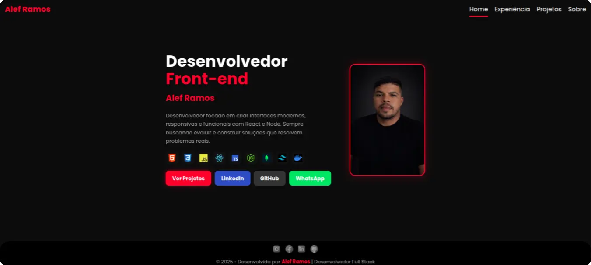

<div align="center">

# 💼 Portfólio — Allef Ramos

**Desenvolvedor Full Stack** especializado em aplicações modernas, performáticas e escaláveis.

[](https://portfolio-dev-alef-ramos.vercel.app/)
[](https://www.linkedin.com/in/allef-ramos)
[](https://github.com/AllefRamos14)

</div>

---

## 📸 Preview

<div align="center">
  
</div>

---

## 📖 Sobre o Projeto

Portfólio desenvolvido para apresentar minha trajetória, projetos e habilidades como desenvolvedor Full Stack.
O foco está em oferecer uma experiência de navegação fluida, com design limpo, responsivo e carregamento otimizado.

---

## 🛠️ Stack de Tecnologias


### 🎨 Front-end


### ⚙️ Back-end


### 🗄️ Banco de Dados


### 🚀 DevOps & Ferramentas


## ✨ Funcionalidades

- 🧑‍💻 Apresentação profissional com foco em experiência do usuário
- 🗂️ Exibição de projetos com preview, descrição e links (GitHub + Demo)
- 📱 Layout totalmente responsivo para todos os dispositivos
- ⚡ Performance otimizada com lazy loading e imagens em WebP
- 🎨 Interface moderna, clean e acessível

---

## ⚡ Performance & Otimizações

| Otimização | Descrição |
|---|---|
| 🖼️ WebP | Imagens convertidas para alta compressão sem perda de qualidade |
| 💤 Lazy Loading | Carregamento sob demanda para melhor performance inicial |
| ⚙️ Vite Build | Bundle otimizado com tree-shaking e code splitting |
| 🏗️ Estrutura leve | Componentes reutilizáveis e código limpo |

---

## 📦 Como rodar localmente

```bash
# clonar repositório
git clone https://github.com/seu-usuario/portfolio.git

# entrar na pasta
cd portfolio

# instalar dependências
yarn

# rodar projeto
yarn dev
```

---

## 📁 Estrutura do projeto

```
src/
  assets/
    profile/
    projects/
  components/
  pages/
  styles/
```

---

## 📌 Funcionalidades

* Apresentação profissional do desenvolvedor
* Exibição de projetos com preview
* Links para GitHub e Demo
* Layout responsivo
* Interface moderna e limpa

---

## 📫 Contato

<div align="center">

| Canal | Link |
|---|---|
| 💼 LinkedIn | [linkedin.com/in/allef-ramos](https://www.linkedin.com/in/allef-ramos) |
| 🐙 GitHub | [github.com/AllefRamos14](https://github.com/AllefRamos14) |
| 📧 E-mail | [aleframos160@gmail.com](mailto:aleframos160@gmail.com) |

https://img.icons8.com/?size=100&id=xuvGCOXi8Wyg&format=png&color=000000
</div>

---

## 📌 Status

🚀 Projeto finalizado e em constante evolução

---

## 🧠 Observações

Este projeto faz parte da minha evolução como desenvolvedor Full Stack, aplicando conceitos modernos de desenvolvimento front-end e integração com back-end.

---

Se este projeto te inspirou, deixe uma ⭐ — significa muito!
